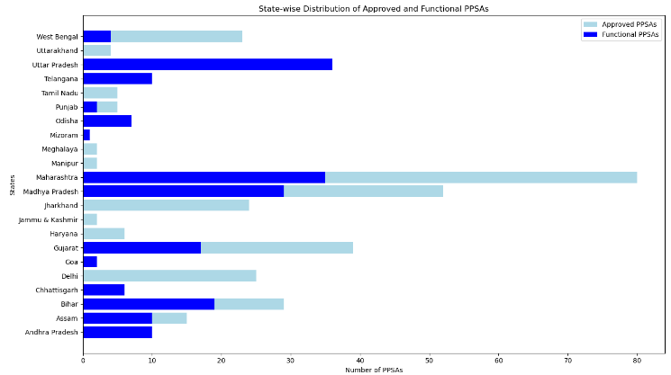

# NTBRS-Chapter-1
Chapter 1 of the "India TB Report 2023" details the organizational structure and functioning of the National Tuberculosis Elimination Programme (NTEP). The NTEP is implemented under the National Health Mission (NHM) with shared resources from the Central and State Governments.

# National TB Report Summary - Chapter 1
> **Brief Description:** - Chapter 1 of the "India TB Report 2023" details the organizational structure and functioning of the National Tuberculosis Elimination Programme (NTEP). The NTEP is implemented under the National Health Mission (NHM) with shared resources from the Central and State Governments.
> 
![Project Logo]TBIndia.png)

---

## Table of Contents

- [Summary](#summary)
- [Program Codes ](#program-codes)
- [Plots](#plots)
- [Contribution](#contributipn)
- [Contact Details](#contact-details)

---

##Summary

**Chapter 1 of the "India TB Report 2023" details the organizational structure and functioning of the National Tuberculosis Elimination Programme (NTEP). The NTEP is implemented under the National Health Mission (NHM) with shared resources from the Central and State Governments.**

### National Level
- Central TB Division (CTD): This is the primary body responsible for formulating policies, plans, and guidelines for TB control in India. It coordinates with state-level entities to ensure the implementation of these policies.
- National Technical Support Unit (NTSU): Established to support innovative interventions, private sector engagement, IT system development, and strategy implementation. It monitors the State Technical Support Units (STSU) and provides technical assistance.
- Technical Support Unit (TSU) for ACSM and AI: Focuses on Advocacy, Communication and Social Mobilization (ACSM) and the use of Artificial Intelligence in TB control efforts.

### State Level
- State TB Cell (STC): Led by the State Tuberculosis Officer (STO), the STC is responsible for the planning, training, supervision, and monitoring of TB control activities within the state. The STC coordinates with the Central TB Division and district-level entities.
- State Tuberculosis Officer (STO): Manages the program at the state level, ensuring alignment with national guidelines and overseeing the implementation of TB control activities.
- State TB Training and Demonstration Centre (STDC): Supports the STC with training, supervision, monitoring, and managing Intermediate Reference Laboratories (IRL).
- State Drug Store (SDS): Manages the logistics of anti-TB drugs to ensure their availability and proper distribution.

### District Level
- District Health Societies: These societies manage the fund flow from the state treasury and oversee the implementation of TB control activities at the district level.
- District TB Centre (DTC): Operates under the District Health Society and is responsible for implementing TB control activities within the district. The DTC ensures that all TB patients receive appropriate diagnosis, treatment, and follow-up.

#### Additional Structures
- State TB Forums: Engage communities in TB control efforts.
- State PMDT Committee: Provides guidance on the Programmatic Management of Drug-resistant TB (PMDT).
- State Technical Working Group for HIV-TB: Coordinates TB and HIV control activities to ensure integrated care for co-infected patients.
- Nodal DR-TB Centres: Manage the treatment of drug-resistant TB, including adverse drug reactions and newer drug regimens.

The chapter emphasizes the importance of a well-structured and collaborative approach at all levels of governance to achieve the goals of the National Strategic Plan (NSP) 2017-2025 for TB elimination in India .

## Program-codes

The programs are written on jupiter notebook, You may run the program on Google colab by clicking on the colab badge below. However, the output may not be generated on colab. For that you have to download the program and run it locally. Make sure that the packages are all installed.

## Plots

## Contribution

The reports and programs are written by Santanu Karmakar

## Contact-details

If you wish to contact me, please leave a message (Preferably WhatsApp) on this number: 6291 894 897.
Please also mention why you are contacting me. Include your name and necessary details.
Thank you for taking an interest.
